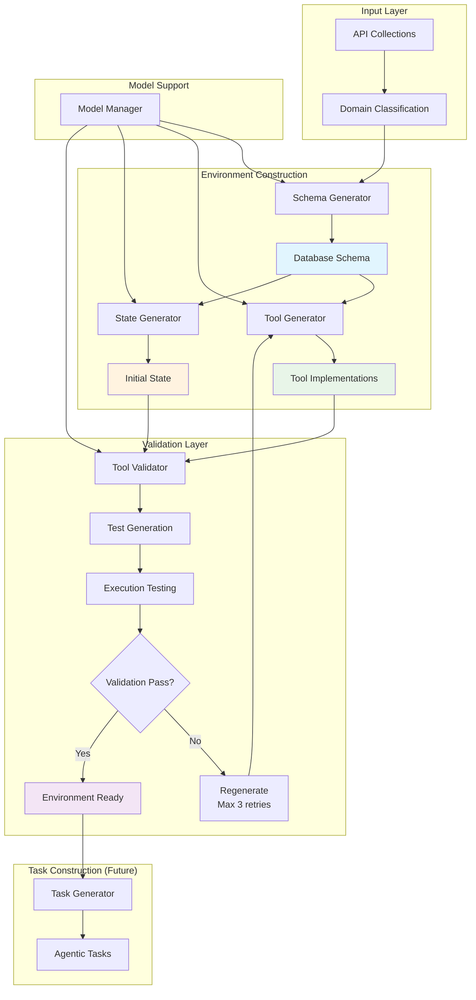

# WorldInteract

A scalable framework for automatic environment construction and agentic intelligence training, inspired by τ-bench and designed for dynamic function-calling scenarios.

## Overview

WorldInteract implements a systematic pipeline for building diverse, fully-simulated environments that enable Large Language Models to develop robust function-calling capabilities through interaction. The framework automatically constructs heterogeneous environments with domain-specific database schemas and tools.

## Architecture



## Project Structure

```
WorldInteract/
├── README.md
├── config/
│   ├── model_config.yaml          # Model configuration for different tasks
│   └── environment_config.yaml    # Environment settings
├── data/
│   ├── apis_collections/           # API collections by domain
│   │   └── api_collection_example.json
│   └── generated/                  # Generated schemas, tools, states
│       └── domains/
│           ├── file_operations/
│           ├── web_browsing/
│           └── ...
├── worldInteract/
│   ├── __init__.py
│   ├── core/
│   │   ├── __init__.py
│   │   ├── environment/            # Environment management
│   │   │   ├── __init__.py
│   │   │   ├── env_manager.py
│   │   │   └── README.md
│   │   ├── schema_generator/       # Database schema generation
│   │   │   ├── __init__.py
│   │   │   ├── generator.py
│   │   │   └── README.md
│   │   ├── tool_generator/         # Tool code generation
│   │   │   ├── __init__.py
│   │   │   ├── generator.py
│   │   │   └── README.md
│   │   └── validator/              # Validation and testing
│   │       ├── __init__.py
│   │       ├── tool_validator.py
│   │       └── README.md
│   ├── domains/                    # Domain-specific implementations
│   │   ├── __init__.py
│   │   └── base.py
│   ├── tasks/                      # Task construction (future)
│   │   ├── __init__.py
│   │   └── README.md
│   └── utils/                      # Utilities (existing)
│       ├── __init__.py
│       ├── model_manager.py
│       └── ...
├── examples/
│   └── create_env.py
├── tests/
│   ├── test_schema_generator.py
│   ├── test_tool_generator.py
│   └── test_validator.py
└── scripts/
    ├── generate_domain.py
    └── validate_tools.py
```

## Key Features

### 🏗️ **Automatic Environment Construction**
- **Dynamic Schema Generation**: LLM-powered database schema creation from API collections
- **Tool Code Generation**: Automatic Python implementation of tools based on schemas
- **State Initialization**: Dynamic generation of realistic initial database states

### 🔍 **Robust Validation System**
- **Execution Testing**: Generated tools are tested with LLM-generated test cases
- **State Verification**: Database state changes are validated for correctness
- **Auto-Retry Mechanism**: Up to 3 retries with tenacity for failed generations

### 🎯 **Multi-Model Support**
- **Flexible Model Selection**: Different LLMs for different generation tasks
- **Model Manager Integration**: Seamless integration with existing model infrastructure
- **Configurable Pipelines**: YAML-based configuration for model assignments

### 📊 **Lightweight Design**
- **JSON-based Storage**: Following τ-bench principles for simplicity
- **In-memory Operations**: Fast database operations without traditional DBMS
- **Stateless Design**: Clean reset capability for reproducible testing

## Installation

```bash
# Install all dependencies
pip install -r requirements.txt
```

## Quick Start

```python
from worldInteract.core.environment import EnvironmentManager

# Initialize environment manager
env_manager = EnvironmentManager()

# Create complete environment from API collection
environment = env_manager.create_environment(
    api_collection_path="data/apis_collections/api_collection_example.json",
    validate_tools=True
)

# Access generated components
schema = environment["schema"]
initial_state = environment["initial_state"]
tools = environment["tools"]
validation_results = environment["validation_results"]
```

### Command Line Usage
```bash
# Generate domain environment (output automatically goes to data/generated/domains/{domain}/)
python scripts/generate_domain.py data/apis_collections/api_collection_example.json

# Generate without validation (faster)
python scripts/generate_domain.py data/apis_collections/api_collection_example.json --no-validate

# Validate generated tools
python scripts/validate_tools.py file_operations

# Run examples
python examples/create_env.py
```

## Configuration

Configure different models for different tasks in `config/model_config.yaml`:

```yaml
schema_generation:
  model: "openai_gpt"
  temperature: 0.3

tool_generation:
  model: "claude_3d7"
  temperature: 0.1

validation:
  model: "qwen3_32b"
  temperature: 0.5
```

## Core Modules

- **[Environment Manager](worldInteract/core/environment/README.md)**: Orchestrates the entire environment construction pipeline
- **[Schema Generator](worldInteract/core/schema_generator/README.md)**: Generates database schemas from API collections
- **[Tool Generator](worldInteract/core/tool_generator/README.md)**: Creates executable tool implementations
- **[Validator](worldInteract/core/validator/README.md)**: Tests and validates generated tools

## Roadmap

- [x] Core environment construction pipeline
- [x] Schema and tool generation
- [x] Validation framework
- [ ] Task construction system
- [ ] Agent experience learning
- [ ] Benchmark integration

## Contributing

Please see [CONTRIBUTING.md](CONTRIBUTING.md) for development guidelines.

## License

This project is licensed under the MIT License - see the [LICENSE](LICENSE) file for details.

