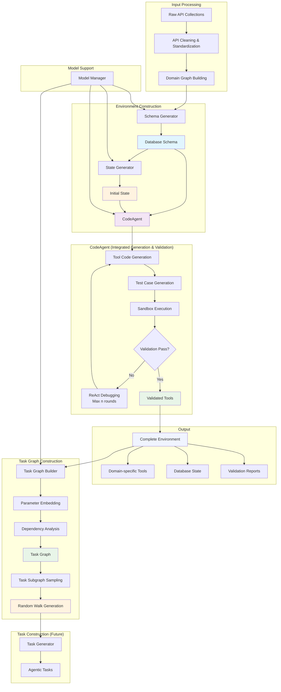

# WorldInteract

A scalable framework for automatic environment construction and agentic intelligence training, inspired by τ-bench, BFCL and designed for dynamic function-calling scenarios.

## Overview

WorldInteract implements a systematic pipeline for building diverse, fully-simulated environments that enable Large Language Models to develop robust function-calling capabilities through interaction. The framework automatically constructs heterogeneous environments with domain-specific database schemas and tools.

## Core Architecture



## Project Structure

```
WorldInteract/
├── README.md
├── config/
│   ├── model_config.yaml          # Model configuration for different tasks
│   └── environment_config.yaml    # Environment settings
├── data/
│   ├── raw_apis/                   # Raw API data
│   │   ├── gorilla_file_system.json
│   │   ├── ticket_api.json
│   │   └── ...
│   ├── processed_apis/             # Cleaned API data
│   │   └── my_cleaned_apis.json
│   ├── apis_collections/           # Domain-classified API collections
│   │   ├── api_collection_example.json
│   │   └── ticket_api_example.json
│   ├── domain_graphs/          # Domain graph analysis results
│   │   └── my_domain_graphs/
│   │       ├── domain_graph.json
│   │       ├── communities.json
│   │       └── domains/
│   └── generated/                  # Generated environments
│       └── domains/
│           ├── file_operations/    # File operations domain
│           ├── database_operations/ # Database operations domain
│           └── ...
├── worldInteract/
│   ├── __init__.py
│   ├── core/
│   │   ├── environment/            # Environment management
│   │   │   └── env_manager.py
│   │   ├── scenario_collection/    # Scenario collection and API cleaning
│   │   │   ├── api_cleaner.py
│   │   │   └── similarity_method.py
│   │   ├── build_domain_graph/       # Domain graph building
│   │   │   └── domain_graph_builder.py
│   │   ├── schema_generator/       # Database schema generation
│   │   │   └── generator.py
│   │   ├── tool_generator/         # Tool code generation (legacy)
│   │   │   └── generator.py
│   │   ├── validator/              # CodeAgent - integrated generation & validation
│   │   │   └── code_agent.py
│   │   ├── sandbox/                # Sandbox execution environment
│   │   │   └── code_executor.py
│   │   └── build_task_graph/       # Task graph construction
│   │       ├── task_graph_builder.py
│   │       ├── task_subgraph_sampler.py
│   │       └── random_walker.py
│   ├── utils/                      # Utility modules
│   │   ├── model_manager.py        # Model management
│   │   ├── config_manager.py       # Configuration management
│   │   ├── embedding/              # Embedding vectors
│   │   │   └── openai_embeddings.py
│   │   └── model_generator/        # Multi-model support
│   │       ├── openai_gpt.py
│   │       ├── claude_3d7.py
│   │       ├── gemini_2d5_pro.py
│   │       └── qwen3_32b.py
│   ├── domains/                    # Domain-specific implementations
│   └── tasks/                      # Task construction (future)
├── examples/
│   ├── create_environment_example.py
│   └── domain_graph_example.py
├── scripts/
│   ├── generate_domain.py          # Domain generation script
│   └── scenario_pipeline.py        # Complete pipeline script
└── tests/
    ├── test_api_normalization.py
    └── example_new_generate_usage.py
```

## Key Features

### 🔄 **Complete Data Processing Pipeline**
- **API Cleaning & Standardization**: Automatically clean and standardize raw API descriptions, supporting multiple formats
- **Domain Graph Building**: Tool similarity analysis and community detection based on embedding vectors
- **Automatic Domain Classification**: Intelligently identify and group related tools into specific domains

### 🏗️ **Automated Environment Construction**
- **Dynamic Schema Generation**: LLM-powered automatic database schema creation
- **Integrated Tool Generation**: CodeAgent combines code generation and validation in one step
- **State Initialization**: Dynamic generation of realistic initial database states

### 🤖 **CodeAgent - Intelligent Generation & Validation**
- **ReAct Pattern**: Uses reasoning and acting pattern for iterative code improvement
- **Integrated Workflow**: Combines tool code generation, test case creation, and validation
- **Sandbox Execution**: Safe code execution environment with package installation support
- **Auto-debugging**: Up to 10 rounds of ReAct-based debugging for failed validations
- **Comprehensive Testing**: LLM-generated test cases validate tool correctness

### 🎯 **Multi-Model Support**
- **Flexible Model Selection**: Different LLMs for different generation tasks
- **Multi-vendor Support**: OpenAI GPT, Claude, Gemini, Qwen, etc.
- **Configurable Pipeline**: YAML-based model assignment configuration

### 🔗 **Task Graph Construction**
- **Parameter Dependency Analysis**: Automatically identify tool dependencies based on parameter similarity
- **Cross-domain Support**: Build task graphs spanning multiple domains
- **Graph Sampling**: Multiple strategies for sampling diverse task subgraphs
- **Random Walk Generation**: Generate Chain and DAG execution sequences for agentic tasks

### 📊 **Lightweight Design**
- **JSON Storage**: Simple storage solution following τ-bench BFCL in-memory database principles
- **In-memory Operations**: Fast operations without traditional database management systems
- **Stateless Design**: Clean reset capability for reproducible testing

## Installation

```bash
# Install all dependencies
pip install -r requirements.txt

# Configure environment variables for OPENAI and CLAUDE api key in .env file
```

## Quick Start

For detailed usage examples and step-by-step tutorials, please see **[examples/README.md](examples/README.md)**.

The examples directory contains comprehensive examples that demonstrate the complete WorldInteract workflow:

1. **Scenario Collection Example** - Process raw API data into cleaned scenarios
2. **Domain Graph Example** - Create tool relationships and domain clustering  
3. **Environment Creation Example** - Generate complete environments with CodeAgent
4. **Task Graph Creation Example** - Build task dependency graphs from environments
5. **Task Subgraph Sampling Example** - Sample diverse subgraphs for task generation
6. **Random Walk Generation Example** - Generate execution sequences from subgraphs
7. **Complete Task Generation Pipeline** - End-to-end task generation workflow

## Configuration

WorldInteract uses two main configuration files with detailed comments to guide your setup:

- **[config/model_config.yaml](config/model_config.yaml)** - Configure different models for different tasks (scenario collection, domain graph, schema generation, CodeAgent, etc.)
- **[config/environment_config.yaml](config/environment_config.yaml)** - Configure environment parameters (thresholds, timeouts, sandbox settings, etc.)

Both files contain comprehensive comments explaining each configuration option. Simply edit these files to customize WorldInteract for your specific needs.

## Core Modules

- **[Environment Manager](worldInteract/core/environment/README.md)**: Orchestrates the entire environment construction pipeline
- **[Scenario Collection](worldInteract/core/scenario_collection/)**: API cleaning, standardization and similarity analysis
- **[Domain Graph Builder](worldInteract/core/build_domain_graph/)**: Tool domain modeling and domain clustering
- **[Schema Generator](worldInteract/core/schema_generator/README.md)**: Generates database schemas from API collections
- **[Tool Generator](worldInteract/core/tool_generator/README.md)**: Creates executable tool implementations (legacy)
- **[CodeAgent](worldInteract/core/validator/README.md)**: Integrated tool generation and validation using ReAct pattern
- **[Sandbox Executor](worldInteract/core/sandbox/)**: Safe code execution environment
- **[Task Graph Builder](worldInteract/core/build_task_graph/)**: Constructs task dependency graphs based on parameter similarity
  - `task_graph_builder.py`: Builds task graphs from generated environments
  - `task_subgraph_sampler.py`: Samples diverse subgraphs using multiple strategies
  - `random_walker.py`: Generates Chain and DAG execution sequences

## Roadmap

- [x] Core environment construction pipeline
- [x] API cleaning and standardization system
- [x] Domain graph building and domain clustering
- [x] Schema and tool generation
- [x] CodeAgent with ReAct-based validation
- [x] Sandbox execution framework
- [x] Multi-model support
- [x] Task graph construction with parameter dependency analysis
- [x] Task subgraph sampling strategies
- [x] Random walk generation (Chain and DAG)
- [ ] Task description generation with LLM
- [ ] Agent experience learning
- [ ] Benchmark integration
- [ ] Visualization interface

## License

