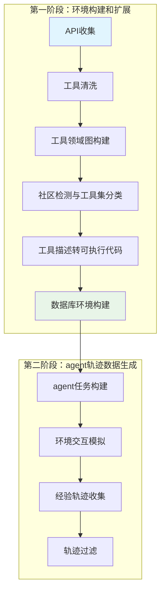
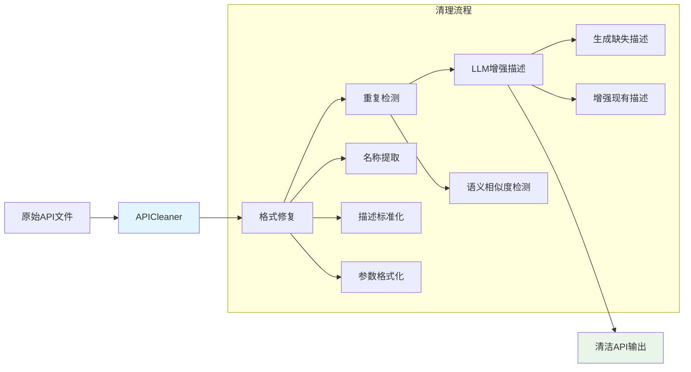
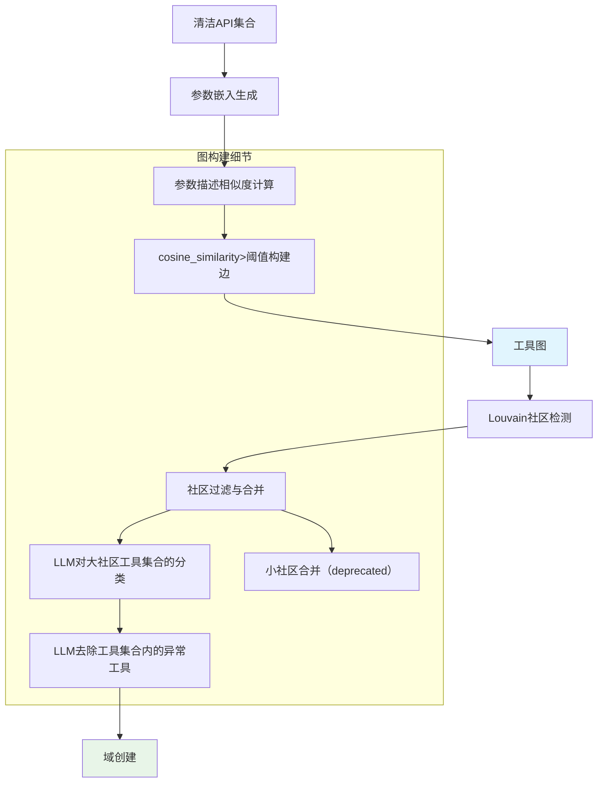
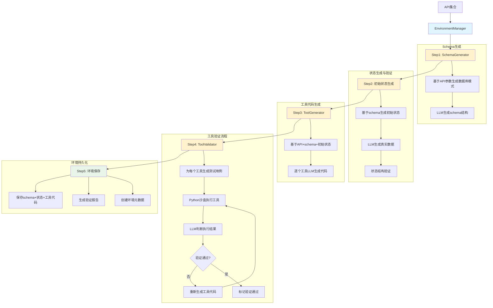

# WorldInteract 项目设计与实现分析

基于论文[《Towards General Agentic Intelligence via Environment Scaling》](https://arxiv.org/abs/2509.13311)的理论框架，本项目旨在利用海量工具定义构建可交互的智能体环境。首先对现有工具集合进行清洗和优化处理，然后根据不同的应用场景对工具进行分类整理，为每个分类场景创建相应的工具集合并开发可交互的环境代码框架，同时建立初始环境配置。通过这一系统化的环境构建过程，生成丰富的环境交互轨迹数据，为后续的监督微调(SFT)提供高质量的训练数据，并为强化学习阶段的环境搭建奠定技术基础。

**Github**: [WorldInteract](https://github.com/zuoyifan132/worldInteract)

## 1. 项目概述

### 1.1 项目背景
本项目是对Tongyi Lab提出的通过环境扩展实现通用智能代理论文的实现，旨在构建一个可扩展的框架，用于自动构建环境并训练智能代理的函数调用能力。

### 1.2 论文总体实现流程

## 2. 项目已实现模块

### 2.1 API收集模块 (Scenario Collection)

#### 模块功能介绍
本模块是整个系统的数据预处理核心，负责从多个来源收集原始API定义，并通过智能化清洗流程将其转换为高质量、标准化的工具描述。主要功能包括：
- **多源API收集**：支持从多个工具源入API定义
- **格式标准化**：将不同格式的API描述统一转换为OpenAI函数调用格式
- **智能去重**：基于语义相似度检测并移除重复或高度相似的工具
- **描述增强**：利用大语言模型自动补全缺失的工具描述并优化现有描述质量
- **质量验证**：确保输出的API定义完整、准确且可执行

#### 设计思路
实现了论文中的**场景收集**步骤，负责清理和标准化原始API描述。

> *"We collected more than 30,000 APIs from ToolBench, API-Gen and our internal tool repository. After applying rigorous filtering, including the removal of low-quality APIs and subsequent refinement"*

#### 模块架构图

#### 技术实现

1. **格式统一**：设置多个工具描述格式template适配海量不同的工具描述并统一template为openai格式

1. **去重机制**：使用embedding模型进行工具描述的向量化并通过语义相似度检测并去除相似度过高的工具

2. **智能描述生成**：
    > *"After applying rigorous filtering, including the removal of low-quality APIs and subsequent refinement"*
 - 利用LLM自动进行缺失的工具描述的补全以及改写

#### 可改进点
- 添加并行处理机制，加快工具清洗以及增强流程
- 收集更多的工具描述template，尽可能的覆盖所有工具描述模版

### 2.2 领域图构建模块 (Domain Graph)

#### 模块功能介绍
本模块实现了基于工具参数语义关系的领域图构建和智能分域功能，是实现工具自动组织和环境构建的关键组件。主要功能包括：
- **参数语义分析**：对工具参数描述进行向量化嵌入，计算参数间的语义相似度
- **工具关系图构建**：基于参数相似度阈值自动构建工具间的领域关系图
- **社区检测分析**：使用Louvain算法对工具图进行社区发现，识别功能相关的工具集群
- **智能域划分**：结合LLM验证，将工具集群组织成逻辑一致的功能域
- **规模优化控制**：自动调整社区大小，确保每个域包含合适数量的工具以便管理和使用

#### 设计思路
实现论文中的**工具领域图建模**，通过参数相似度构建工具关系图，并使用Louvain社区检测算法进行域分割。

> *"We construct a tool graph in which nodes are tools and edges encode compositional compatibility induced by function parameters... Domain partitioning then reduces to a graph clustering problem."*

#### 模块架构图

#### 技术实现特点

1. **相似度阈值设计**： 
    > *"For a pair of tools, we can extract their respective parameter lists and convert them into vector representations ϕ to compute their cos-similarity. If the similarity exceeds a predefined threshold τ, we consider there to be a dependency relationship between the two tools."*

    通过工具参数描述语义相似度，判断任意两个工具是否相关，若任意两个工具参数的描述相关，则认为两工具相关

2. **社区规模控制**：
   - 最小社区大小：2个工具（可配置）
   - 最大社区大小：20个工具（可配置）
   - LLM对过大工具集合进行精细工具集合划分

3. **LLM增强验证**：
   - 对工具组进行语义一致性验证
   - 自动移除不相关工具
   - 生成域名称和描述

#### 可改进点
- 在LLM验证的同时可以将大的工具集合进行划分以及无关工具的去除，合并为一步
- 可以考虑使用加权求和的相关度作为工具图中的边的weight，越多相似的参数描述表示越相关，在后续的轨迹生成的random walk中也可以使用该策略

### 2.3 环境管理模块 (Environment Manager)

#### 模块功能介绍
本模块是整个环境构建流程的核心协调器，负责统筹调度各个子模块完成完整的环境自动化构建。主要功能包括：
- **全流程编排**：协调数据库模式生成、工具代码生成、初始状态创建等所有环境构建步骤
- **自动化环境构建**：从API集合自动生成完整的可交互环境，包括数据库结构和可执行工具
- **初始状态生成**：基于数据库模式自动创建真实的初始数据状态，可用于后续轨迹生成时初始状态生成的few shot示例
- **工具验证管理**：集成工具验证流程，确保生成的工具代码以及生成的schema以及初始状态配套正确执行
- **环境持久化**：完整保存和加载环境配置，支持环境的复用和版本管理

#### 设计思路
实现论文中的**函数模式程序化物化**步骤，将工具描述转换为可在数据库上执行的代码，并构建完整的可交互环境。

> *"We first leverage the parameters of all tools within a domain to generate a domain-specific database structure, which serves as the underlying state for subsequent tool operations... we can formalize each tool in python code, enabling it to perform read–write operations over the database schema."*

#### 模块架构图

#### 技术实现特点

1. **步骤化流程**：
   > *"We first leverage the parameters of all tools within a domain to generate a domain-specific database structure, which serves as the underlying state for subsequent tool operations."*
   
   严格按照5步流程执行：Schema生成(schema_generator) → 初始状态生成(generate_initial_state) → 工具代码生成(tool_generator) → 工具验证(validator) → 环境保存

2. **智能状态生成**：
   - 基于数据库模式自动生成多样化的初始数据
   - 支持域特定的数据生成配置（记录数量、字段类型等）
   - 生成的初始状态可作为后续轨迹生成时的few-shot示例

3. **沙盒化工具验证**：
   - **测试用例生成**：为每个工具使用LLM生成符合当前数据初始状态的测试用例
   - **Python沙盒执行**：在隔离环境中执行工具代码
   - **LLM结果判断**：使用大模型分析执行工具执行结果是否符合预期行为
   - **自动重新生成**：验证失败的工具自动重新生成代码（最多3次尝试）

4. **环境完整性保证**：
   - 确保schema、初始状态、工具代码三者的完全兼容性
   - 详细的验证报告记录每个工具的测试结果，可进行后期的工具修复

#### 可改进点
- 工具的验证可以使用ReAct Agent的进行，根据失败的报错信息或者不符合预期的原因修改工具的实现

## 3. 待实现模块

### 3.1 轨迹生成模块 (Tasks Module) - 待实现

#### 模块功能介绍
本模块是论文第二阶段`Agentic Task Construction`的核心实现，负责基于构建好的环境自动生成高质量的智能体交互轨迹数据。
#### 设计思路

> *"We construct trajectories via forward simulated agent–human interplay, which allows us to fully simulate the environment, the user, and the agent. The critical step is to synthesize agentic tasks that elicit human tool usage while ensuring that the resulting trajectories remain verifiable."*

本模块将采用四阶段流程：
- 首先从工具领域图中进行有向随机游走生成逻辑工具序列
- 然后基于工具序列和初始环境状态生成用户任务意图
- 最后通过模拟用户与智能体的多轮交互生成完整的轨迹数据
- 并对生成的轨迹进行质量过滤和格式转换